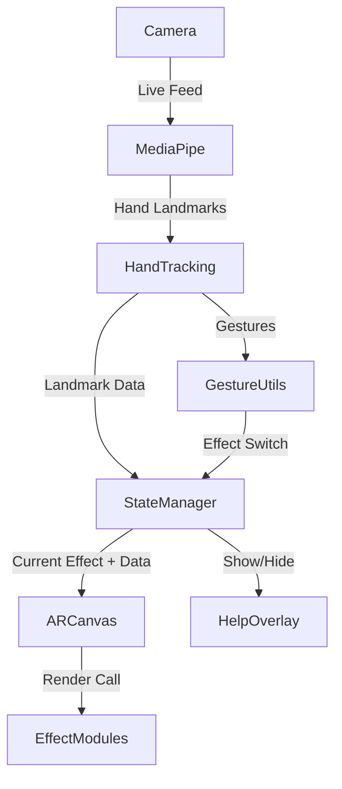

Sure! Here's a complete architecture document for your web-based AR application, formatted in **Markdown**:

---

# 🌐 AR Web Application Architecture

This AR application uses **MediaPipe** for hand tracking, **Three.js** for 3D rendering, and a **webcam** feed as the background. The user interacts using hand gestures to switch between three visual effects.

---

## 📁 Folder + File Structure

```
ar-hand-effects/
├── public/
│   └── index.html             # Main HTML entry point
├── src/
│   ├── assets/                # Assets like textures, icons, help images
│   ├── components/            # Reusable UI components (e.g., HelpOverlay)
│   ├── effects/
│   │   ├── effect1Rings.js    # Coloured rings + fire trail effect
│   │   ├── effect2Flower.js   # Wireframe flower + pinch to move
│   │   └── effect3Lines.js    # Coloured trail lines from index finger
│   ├── tracking/
│   │   └── handTracking.js    # MediaPipe hand tracking setup + gesture detection
│   ├── utils/
│   │   ├── gestureUtils.js    # Gesture recognition logic
│   │   └── threeUtils.js      # Helpers for Three.js objects, materials, etc.
│   ├── App.js                 # Main application logic
│   ├── ARCanvas.js            # Sets up Three.js scene, camera, renderer
│   ├── StateManager.js        # Centralized app state
│   └── main.js                # App entry point
├── styles/
│   └── styles.css             # Global styles
├── .gitignore
├── package.json
└── README.md
```

---

## 📦 What Each Part Does

### `public/index.html`

* Hosts the webcam stream and Three.js canvas
* Loads the JavaScript bundle from `main.js`

### `src/main.js`

* Entry point: initializes the app by mounting `App.js`

### `src/App.js`

* Initializes:

  * MediaPipe hand tracking
  * Three.js scene via `ARCanvas`
  * UI overlays (e.g., help)
* Observes state changes and routes events to the active effect

### `src/ARCanvas.js`

* Sets up Three.js:

  * Scene
  * Camera
  * WebGL renderer
  * AR elements
* Calls active effect’s render loop

### `src/tracking/handTracking.js`

* Sets up MediaPipe Hands
* Listens to camera input and updates hand landmark data
* Emits recognized gestures to `StateManager`

### `src/utils/gestureUtils.js`

* Gesture detection logic (e.g., open palm, pinch)
* Maps gestures to effect-switching commands

### `src/utils/threeUtils.js`

* Helper functions for:

  * Creating meshes
  * Common materials
  * Coordinate conversions

### `src/effects/`

Each effect is encapsulated in its own module:

#### `effect1Rings.js`

* Adds rings to finger tips
* Trails ring movement to create fire-like evanescent lines
* Uses hand landmarks to position rings

#### `effect2Flower.js`

* Renders a cute wireframe flower
* Detects pinch gesture to allow 3D dragging of the flower
* Tracks 3D position based on pinch center

#### `effect3Lines.js`

* Draws thick, colorful trails from the index finger
* Trails follow hand in 3D, using line geometry with smoothing

### `src/components/HelpOverlay.js`

* Renders help instructions
* Displays gesture to effect mapping
* Toggles visibility on user demand

### `src/StateManager.js`

* **Central state control** for:

  * Current active effect
  * Recognized hand gestures
  * Hand landmark data
* Publishes state changes using an event system or observer pattern

---

## 🔁 Data Flow & State Management



* **State Lives in `StateManager`**

  * Reactive data model (use signals, observables, or event bus)
  * Can use a library like `valtio`, `zustand`, or custom observable class

* **Services Connect via Pub/Sub or Observer Pattern**

  * Gesture recognizer notifies `StateManager` of user actions
  * Rendering logic subscribes to state updates (e.g., when switching effects)
  * Effects receive latest hand landmarks from `StateManager`

---

## 🧠 Gesture Mapping (Example)

| Gesture        | Effect                 |
| -------------- | ---------------------- |
| Open palm      | Effect 1 (Rings)       |
| Pinch (hold)   | Effect 2 (Flower drag) |
| Pointing index | Effect 3 (Trail lines) |

* Implement fallback help overlay (`HelpOverlay`) that shows this table visually.

---

## 🛠️ Technologies Used

* **Three.js** – 3D rendering and effects
* **MediaPipe Hands** – Real-time hand tracking
* **HTML5/Webcam** – Live video feed
* **JavaScript Modules** – Component-based architecture
* **(Optional) Vite/Webpack** – Build and serve app

---

## ✅ Development Tips

* Use `requestAnimationFrame` loop in `ARCanvas` to call the current effect’s draw/update method.
* Keep each effect modular with `init()`, `update(landmarks)`, and `dispose()` methods.
* Apply smoothing filters to landmark data to avoid jitter.
* Test gestures in a variety of lighting conditions.

---

Let me know if you'd like the full implementation of any effect or a sample `App.js` to bootstrap the app.
